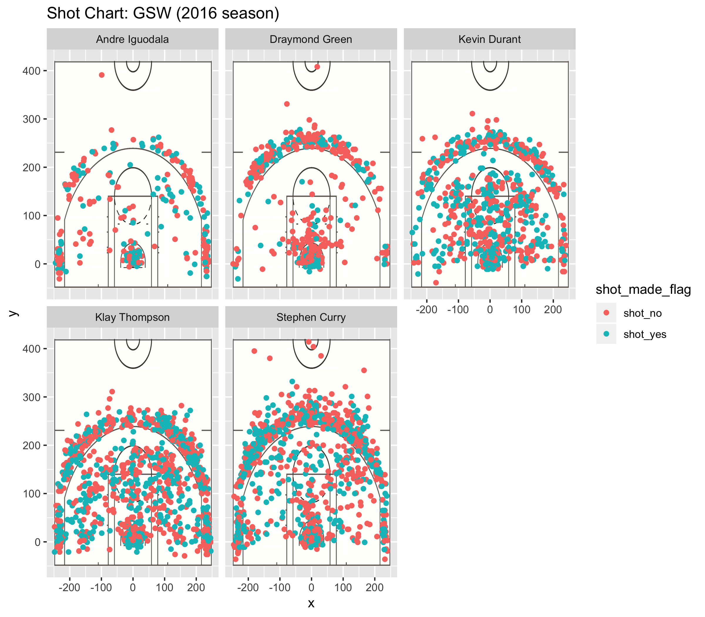

```{r, echo=FALSE}
library(dplyr)
library(ggplot2)
andre_iguodala <-  read.csv("../data/andre-iguodala.csv", 
                            stringsAsFactors = FALSE, 
                            colClasses = c("character", "character", "integer", "integer", "integer", "integer", "character", "factor", "factor", "integer", "character", "integer","integer"))

draymond_green <-  read.csv("../data/draymond-green.csv", 
                            stringsAsFactors = FALSE, 
                            colClasses = c("character", "character", "integer", "integer", "integer", "integer", "character", "factor", "factor", "integer", "character", "integer","integer"))

kevin_durant <-  read.csv("../data/kevin-durant.csv", 
                          stringsAsFactors = FALSE, 
                          colClasses = c("character", "character", "integer", "integer", "integer", "integer", "character", "factor", "factor", "integer", "character", "integer","integer"))

klay_thompson <-  read.csv("../data/klay-thompson.csv", 
                           stringsAsFactors = FALSE, 
                           colClasses = c("character", "character", "integer", "integer", "integer", "integer", "character", "factor", "factor", "integer", "character", "integer","integer"))

stephen_curry <-  read.csv("../data/stephen-curry.csv", 
                           stringsAsFactors = FALSE, 
                           colClasses = c("character", "character", "integer", "integer", "integer", "integer", "character", "factor", "factor", "integer", "character", "integer","integer"))


# Data Modifications
# modifications for andre
andre_iguodala <- cbind(name = "Andre Iguodala", andre_iguodala)  # add column "name"

n_andre <- andre_iguodala$shot_made_flag == "n"       
andre_iguodala$shot_made_flag[n_andre] <- "shot_no"     # modify "n"

y_andre <- andre_iguodala$shot_made_flag == "y"
andre_iguodala$shot_made_flag[y_andre] <- "shot_yes"    # modify "y"

andre_iguodala$minute <- 12 * andre_iguodala$period - andre_iguodala$minutes_remaining   # add column "minute"


# modifications for draymond
draymond_green <- cbind(name = "Draymond Green", draymond_green)

n_draymond <- draymond_green$shot_made_flag == "n"
draymond_green$shot_made_flag[n_draymond] <- "shot_no"

y_draymond <- draymond_green$shot_made_flag == "y"
draymond_green$shot_made_flag[y_draymond] <- "shot_yes"

draymond_green$minute <- 12 * draymond_green$period - draymond_green$minutes_remaining


# modifications for kevin
kevin_durant <- cbind(name = "Kevin Durant", kevin_durant)

n_kevin <- kevin_durant$shot_made_flag == "n"
kevin_durant$shot_made_flag[n_kevin] <- "shot_no"

y_kevin <- kevin_durant$shot_made_flag == "y"
kevin_durant$shot_made_flag[y_kevin] <- "shot_yes"

kevin_durant$minute <- 12 * kevin_durant$period - kevin_durant$minutes_remaining


# modifications for klay
klay_thompson <- cbind(name = "Klay Thompson", klay_thompson)

n_klay <- klay_thompson$shot_made_flag == "n"
klay_thompson$shot_made_flag[n_klay] <- "shot_no"

y_klay <- klay_thompson$shot_made_flag == "y"
klay_thompson$shot_made_flag[y_klay] <- "shot_yes"

klay_thompson$minute <- 12 * klay_thompson$period - klay_thompson$minutes_remaining


# modifications for stephen
stephen_curry <- cbind(name = "Stephen Curry", stephen_curry)
n_stephen <- stephen_curry$shot_made_flag == "n"
stephen_curry$shot_made_flag[n_stephen] <- "shot_no"

y_stephen <- stephen_curry$shot_made_flag == "y"
stephen_curry$shot_made_flag[y_stephen] <- "shot_yes"

stephen_curry$minute <- 12 * stephen_curry$period - stephen_curry$minutes_remaining

shots_data <- rbind(andre_iguodala, draymond_green, kevin_durant, klay_thompson, stephen_curry)

library(ggplot2)
library(jpeg)
library(grid)
# court image (to be used as background of plot)
court_file <- "../images/nba-court.jpg"

## create raster object
court_image <- rasterGrob(
  readJPEG(court_file),
  width = unit(1, "npc"),
  height = unit(1, "npc"))

```


  Before the start of the 2016-17 regular season, a lot of significant changes had been made to the Golden State Warriors. Along with the leaving of Harrison Barnes (Shooting Forward), Marreese Speights (Center), and Leandro Barbosa (Shooting Guard), Kevin Durant announced his joining. He left the Oklahoma City Thunder and became a Warrior because of the environment that the Warriors had fostered in the past years, with the big help from Curry. During the season of 2016-17, the Golden State Warriors had achieved many momentous achievements through the efforts made by the whole team, despite the absence of Stephen Curry for the last three games and the absence of Draymond Green for two of the last three games. Here’s the statistics for the effective shootings (Percentage of 2PT Effective Shootings by Player; Percentage of 3PT Effective Shootings by Player; Total Effective Shootings by Player) that they had made throughout the season:
    
## 2PT Effective Shooting % by Player:
```{r}
arrange(summarise(group_by(shots_data, name), total = sum(shot_type == "2PT Field Goal"), made = sum(shot_made_flag == "shot_yes" & shot_type == "2PT Field Goal"), perc_made = made/total), desc(perc_made))
```
## 3PT Effective Shooting % by Player:
```{r}
arrange(summarise(group_by(shots_data, name), total = sum(shot_type == "3PT Field Goal"), made = sum(shot_made_flag == "shot_yes" & shot_type == "3PT Field Goal"), perc_made = made/total), desc(perc_made))
```
## Effective Shooting % by Player:
```{r}
arrange(summarise(group_by(shots_data, name), total = length(shot_made_flag), made = sum(shot_made_flag == "shot_yes"), perc_made = made/total), desc(perc_made))
```
  
  
    
  From the statistics above, we can clearly see the remarkable performance from Kevin Durant, served as a Pointing Forward and scored 54% of the points shot. Kevin has totally made 643 shots of 2-point with 60.65% effective rate and 272 shots of 3-point with 38.60% effective rate. 
  
  
  


  The graph below shows a more visual density of the effective shootings from Kevin Durant. It clearly indicates that Kevin gets most of the scored points under the basket.
```{r}
ggplot(data = kevin_durant[kevin_durant$shot_made_flag == "shot_yes",], aes(x = x, y = y)) + annotation_custom(court_image, -250, 250, -50, 420) + geom_point(color = "blue", alpha = 0.6) + ylim(-50, 420) + geom_density2d(color = "red") + ggtitle('Kevin Durant Effective Shootings Distribution (2016 season)') + theme_minimal() 

ggplot(data = kevin_durant[kevin_durant$shot_made_flag == "shot_yes",]) + geom_histogram(aes(minute), binwidth = 10, alpha = 0.8) + ggtitle('Histogram of Scored Points by Time Intervals (Kevin Durant 2016 season)') + theme_minimal()
```


The histogram demonstrates the count of scored points by time distribution in a game. 


  The player with the second best performance on the total effective shooting rate is Andre Iguodala, who was named the NBA Finals Most Valuable Player (MVP) in 2015.  Although he made the least shootings among the Warriors in this season, he owned the best 2-point effective rate in this season, which is 63.80%. However, his 3-point effective rate was only 36.02%. He made the most scored points during the second period.
```{r}
ggplot(data = andre_iguodala[andre_iguodala$shot_made_flag == "shot_yes",], aes(x = x, y = y)) + annotation_custom(court_image, -250, 250, -50, 420) + geom_point(color = "blue", alpha = 0.6) + ylim(-50, 420) + geom_density2d(color = "red") + ggtitle('Andre Iguodala Effective Shootings Distribution (2016 season)') + theme_minimal() 

ggplot(andre_iguodala[andre_iguodala$shot_made_flag == "shot_yes",]) + geom_histogram(aes(minute), binwidth = 10, alpha = 0.8) + ggtitle('Histogram of Scored Points by Time Intervals (Andre Iguodala 2016 season)') + theme_minimal()
```
  

  
  The third on the list of total effective shooting rate is Klay Thompson. He made 51.40% of his 2-point shootings effective and 42.41% of his 3-point shootings effective. His ability to shoot effective 2 points and 3 points is relatively average than other players in the team. His density of effective shootings tends to be the strongest under the basket, and it skewed to the left part of the court.
```{r}
ggplot(data = klay_thompson[klay_thompson$shot_made_flag == "shot_yes",], aes(x = x, y = y)) + annotation_custom(court_image, -250, 250, -50, 420) + geom_point(color = "blue", alpha = 0.6) + ylim(-50, 420) + geom_density2d(color = "red") + ggtitle('Klay Thompson Effective Shootings Distribution (2016 season)') + theme_minimal() 
```


He also tended to have a better performance in the first three periods, and the relatively accumulated scored points declined sharply.


```{r}
ggplot(klay_thompson[klay_thompson$shot_made_flag == "shot_yes",]) + geom_histogram(aes(minute), binwidth = 10, alpha = 0.8) + ggtitle('Histogram of Scored Points by Time Intervals (Klay Thompson 2016 season)') + theme_minimal()
```


  Stephen did not own a very good rank in the list of total effective shooting rate for this season. Only 584 shots were scored out of the total 1250 shots he made in this season. However, 3-point shooting was still his biggest strengths. He made 280 out of 687 shots of 3-point effective, which is 40.75% of the rate. He had a rate of 54.00% for 2-point shootings, which is quite the average. His strength of 3-point shootings can be obviously visualized by the graph below. He had a better density of scored points on the side than at the center of the court. Instead of shooting more scored points in the first half of games, he tended to gain better sense of shooting in the third period, which is a big difference with the other players in the team. He totally made 54.98% his shootings a 3-point shootings (687 3-point shootings out of 1250 shootings). 
```{r}
ggplot(data = stephen_curry[stephen_curry$shot_made_flag == "shot_yes",], aes(x = x, y = y)) + annotation_custom(court_image, -250, 250, -50, 420) + geom_point(color = "blue", alpha = 0.6) + ylim(-50, 420) + geom_density2d(color = "red") + ggtitle('Stephen Curry Effective Shootings Distribution (2016 season)') + theme_minimal() 

ggplot(stephen_curry[stephen_curry$shot_made_flag == "shot_yes",]) + geom_histogram(aes(minute), binwidth = 10, alpha = 0.8) + ggtitle('Histogram of Scored Points by Time Intervals (Stephen Curry 2016 season)') + theme_minimal()
```


This is a barplot that shows the most action types Stephen has made in this season, and “jump shot” won the most.


```{r}
stephen_action_type <- table(stephen_curry$action_type)
barplot(tail(sort(stephen_action_type)))
```
  


  Draymond Green is the last on the list. He had the relatively least scored points in this season. He had made total 42.38% of his shootings effective, 31.90% of his 3-point shootings effective, and 49.42% of his 2-point shootings effective. He made the second least shootings in the total. However, compared to Andre, his effective rate is much lower than him. 
```{r}
ggplot(data = draymond_green[draymond_green$shot_made_flag == "shot_yes",], aes(x = x, y = y)) + annotation_custom(court_image, -250, 250, -50, 420) + geom_point(color = "blue", alpha = 0.6) + ylim(-50, 420) + geom_density2d(color = "red") + ggtitle('Draymond Green Effective Shootings Distribution (2016 season)') + theme_minimal() 

ggplot(draymond_green[draymond_green$shot_made_flag == "shot_yes",]) + geom_histogram(aes(minute), binwidth = 10, alpha = 0.8) + ggtitle('Histogram of Scored Points by Time Intervals (Draymond Green 2016 season)') + theme_minimal()
```


He made the best performance of shooting in the second periods.


  We have to admit that the Golden State Warriors had made an excellent performance overall. They obtained a 16-1 score in the playoffs and won the third consecutive matchup in the NBA Finals after beating the Cleveland Cavaliers. Below demonstrates the overall performance visually by player. 
  
  
```{r out.width='80%', echo=FALSE, fig.align='center'}

```


  As aforementioned, it is obvious that Kevin and Stephen had made the most shootings in this season. The Warriors have made the NBA become the GSW era. We hope that the Warriors can remain their legend in the coming new season. Go Warriors!


