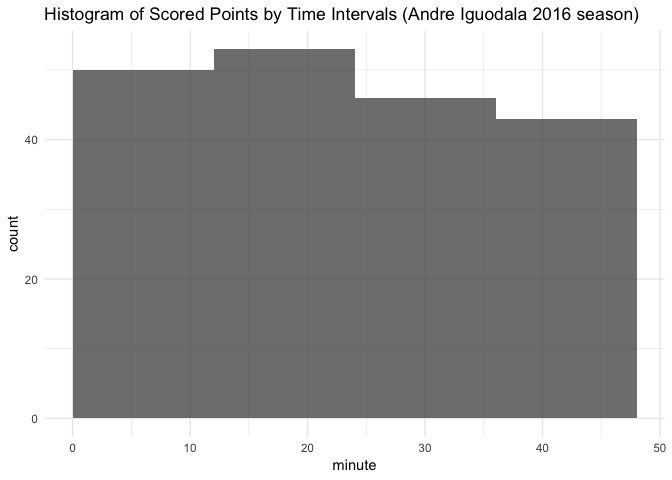
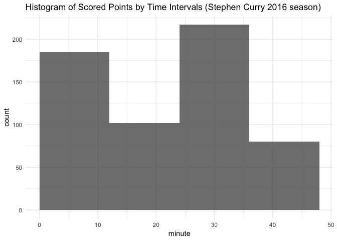

GSW Player Statistics Analysis
================
Zixuan Li
3/12/2019


    ## 
    ## Attaching package: 'dplyr'

    ## The following objects are masked from 'package:stats':
    ## 
    ##     filter, lag

    ## The following objects are masked from 'package:base':
    ## 
    ##     intersect, setdiff, setequal, union

Before the start of the 2016-17 regular season, a lot of significant changes had happened to the Golden State Warriors. Along with the leaving of Harrison Barnes (Shooting Forward), Marreese Speights (Center), and Leandro Barbosa (Shooting Guard), Kevin Durant had announced his joining. He left the Oklahoma City Thunder and became a Warrior because of the environment that the Warriors had fostered in the past years, with the big help from Curry. During the season of 2016-17, the Golden State Warriors had achieved many momentous achievements through the efforts made by the whole team, despite the absence of Stephen Curry for the last three games and the absence of Draymond Green for two of the last three games. Here’s the statistics for the performance of the Golden State Warriors (the effective shootings (Percentage of 2PT Effective Shootings by Player; Percentage of 3PT Effective Shootings by Player; Total Effective Shootings by Player) that they had made throughout the season):

2PT Effective Shooting % by Player:
-----------------------------------

``` r
arrange(summarise(group_by(shots_data, name), total = sum(shot_type == "2PT Field Goal"), made = sum(shot_made_flag == "shot_yes" & shot_type == "2PT Field Goal"), perc_made = made/total), desc(perc_made))
```

    ## Warning: `as_dictionary()` is soft-deprecated as of rlang 0.3.0.
    ## Please use `as_data_pronoun()` instead
    ## This warning is displayed once per session.

    ## Warning: `new_overscope()` is soft-deprecated as of rlang 0.2.0.
    ## Please use `new_data_mask()` instead
    ## This warning is displayed once per session.

    ## Warning: The `parent` argument of `new_data_mask()` is deprecated.
    ## The parent of the data mask is determined from either:
    ## 
    ##   * The `env` argument of `eval_tidy()`
    ##   * Quosure environments when applicable
    ## This warning is displayed once per session.

    ## Warning: `overscope_clean()` is soft-deprecated as of rlang 0.2.0.
    ## This warning is displayed once per session.

    ## # A tibble: 5 x 4
    ##             name total  made perc_made
    ##           <fctr> <int> <int>     <dbl>
    ## 1 Andre Iguodala   210   134 0.6380952
    ## 2   Kevin Durant   643   390 0.6065319
    ## 3  Stephen Curry   563   304 0.5399645
    ## 4  Klay Thompson   640   329 0.5140625
    ## 5 Draymond Green   346   171 0.4942197

3PT Effective Shooting % by Player:
-----------------------------------

``` r
arrange(summarise(group_by(shots_data, name), total = sum(shot_type == "3PT Field Goal"), made = sum(shot_made_flag == "shot_yes" & shot_type == "3PT Field Goal"), perc_made = made/total), desc(perc_made))
```

    ## # A tibble: 5 x 4
    ##             name total  made perc_made
    ##           <fctr> <int> <int>     <dbl>
    ## 1  Klay Thompson   580   246 0.4241379
    ## 2  Stephen Curry   687   280 0.4075691
    ## 3   Kevin Durant   272   105 0.3860294
    ## 4 Andre Iguodala   161    58 0.3602484
    ## 5 Draymond Green   232    74 0.3189655

Effective Shooting % by Player:
-------------------------------

``` r
arrange(summarise(group_by(shots_data, name), total = length(shot_made_flag), made = sum(shot_made_flag == "shot_yes"), perc_made = made/total), desc(perc_made))
```

    ## # A tibble: 5 x 4
    ##             name total  made perc_made
    ##           <fctr> <int> <int>     <dbl>
    ## 1   Kevin Durant   915   495 0.5409836
    ## 2 Andre Iguodala   371   192 0.5175202
    ## 3  Klay Thompson  1220   575 0.4713115
    ## 4  Stephen Curry  1250   584 0.4672000
    ## 5 Draymond Green   578   245 0.4238754

Kevin Durant
============

As a "new star" of the Warriors, Kevin did not let everybody down. From the statistics above, we can clearly see the remarkable performance from Kevin Durant, served as a Pointing Forward and scored 54% of the points he shot. Kevin has totally made 643 shots of 2-point with a 60.65% effective rate and 272 shots of 3-point with a 38.60% effective rate. Kevin had very well played in his first season as a Golden Warrior.


The scatterplot below shows the positions where he made shootings with a more visual 2-dimensional density of the effective shootings from Kevin Durant. It clearly indicates that Kevin gets more points being closer to the spot under basket. In addition, the histogram below demonstrates the accumulated count of scored points in each period during the game. According to the statistics about Kevin's effective shootings rate in each period, Kevin had the best sense of shooting in the second period and worst in the last period.

``` r
ggplot(data = kevin_durant[kevin_durant$shot_made_flag == "shot_yes",], aes(x = x, y = y)) + annotation_custom(court_image, -250, 250, -50, 420) + geom_point(color = "blue", alpha = 0.6) + ylim(-50, 420) + geom_density2d(color = "red") + ggtitle('Kevin Durant Effective Shootings Distribution (2016 season)') + theme_minimal() 
```


``` r
ggplot(data = kevin_durant[kevin_durant$shot_made_flag == "shot_yes",]) + geom_histogram( aes(minute), breaks = seq(0, 48, 12), alpha = 0.8) + ggtitle('Histogram of Scored Points by Time Intervals (Kevin Durant 2016 season)') + theme_minimal()
```


``` r
kevin_period1 <- kevin_durant[kevin_durant$period == 1,]
kevin_period1 <- sum(kevin_period1$shot_made_flag == "shot_yes") / length(kevin_period1$shot_made_flag)

kevin_period2 <- kevin_durant[kevin_durant$period == 2,]
kevin_period2 <- sum(kevin_period2$shot_made_flag == "shot_yes") / length(kevin_period2$shot_made_flag)

kevin_period3 <- kevin_durant[kevin_durant$period == 3,]
kevin_period3 <- sum(kevin_period3$shot_made_flag == "shot_yes") / length(kevin_period3$shot_made_flag)

kevin_period4 <- kevin_durant[kevin_durant$period == 4,]
kevin_period4 <- sum(kevin_period4$shot_made_flag == "shot_yes") / length(kevin_period4$shot_made_flag)

kevin_period1
```

    ## [1] 0.5478927

``` r
kevin_period2
```

    ## [1] 0.5737052

``` r
kevin_period3
```

    ## [1] 0.5299145

``` r
kevin_period4
```

    ## [1] 0.4970414

Andre Iguodala
==============

The player that had the second best performance on the total effective shooting rate is Andre Iguodala, who was named the NBA Finals Most Valuable Player (MVP) in 2015. Although he made the least total shootings among the Warriors in this season, he became the player with the best 2-point effective rate in that season, which is 63.80%. However, his 3-point effective rate was only 36.02%. According to the histogram below, he made most of his scored points during the first and second period. His best shooting performance occured in the first periods, with is 61.73%.

``` r
ggplot(data = andre_iguodala[andre_iguodala$shot_made_flag == "shot_yes",], aes(x = x, y = y)) + annotation_custom(court_image, -250, 250, -50, 420) + geom_point(color = "blue", alpha = 0.6) + ylim(-50, 420) + geom_density2d(color = "red") + ggtitle('Andre Iguodala Effective Shootings Distribution (2016 season)') + theme_minimal() 
```


``` r
ggplot(andre_iguodala[andre_iguodala$shot_made_flag == "shot_yes",]) + geom_histogram(aes(minute), breaks = seq(0, 48, 12), alpha = 0.8) + ggtitle('Histogram of Scored Points by Time Intervals (Andre Iguodala 2016 season)') + theme_minimal()
```



``` r
andre_period1 <- andre_iguodala[andre_iguodala$period == 1,]
andre_period1 <- sum(andre_period1$shot_made_flag == "shot_yes") / length(andre_period1$shot_made_flag)

andre_period2 <- andre_iguodala[andre_iguodala$period == 2,]
andre_period2 <- sum(andre_period2$shot_made_flag == "shot_yes") / length(andre_period2$shot_made_flag)

andre_period3 <- andre_iguodala[andre_iguodala$period == 3,]
andre_period3 <- sum(andre_period3$shot_made_flag == "shot_yes") / length(andre_period3$shot_made_flag)

andre_period4 <- andre_iguodala[andre_iguodala$period == 4,]
andre_period4 <- sum(andre_period4$shot_made_flag == "shot_yes") / length(andre_period4$shot_made_flag)

andre_period1
```

    ## [1] 0.617284

``` r
andre_period2
```

    ## [1] 0.4774775

``` r
andre_period3
```

    ## [1] 0.5411765

``` r
andre_period4
```

    ## [1] 0.4574468

Klay Thompson
=============

The third on the list of total effective shooting rate is Klay Thompson. He made 51.40% of his 2-point shootings effective and 42.41% of his 3-point shootings effective. His ability to shoot effective 2 points and 3 points is relatively average than other players in the team. His density of effective shootings tends to be the strongest under the basket, and it skewed to the left part of the court.

``` r
ggplot(data = klay_thompson[klay_thompson$shot_made_flag == "shot_yes",], aes(x = x, y = y)) + annotation_custom(court_image, -250, 250, -50, 420) + geom_point(color = "blue", alpha = 0.6) + ylim(-50, 420) + geom_density2d(color = "red") + ggtitle('Klay Thompson Effective Shootings Distribution (2016 season)') + theme_minimal() 
```


He also tended to have a better performance in the first three periods, and the relatively accumulated scored points declined sharply.

``` r
ggplot(klay_thompson[klay_thompson$shot_made_flag == "shot_yes",]) + geom_histogram(aes(minute), breaks = seq(0, 48, 12), alpha = 0.8) + ggtitle('Histogram of Scored Points by Time Intervals (Klay Thompson 2016 season)') + theme_minimal()
```


Stephen Curry
=============

Stephen did not own a very good rank in the list of total effective shooting rate for this season. Only 584 shots were scored out of the total 1250 shots he made in this season. However, 3-point shooting was still his biggest strengths. He made 280 out of 687 shots of 3-point effective, which is 40.75% of the rate. He had a rate of 54.00% for 2-point shootings, which is quite the average. His strength of 3-point shootings can be obviously visualized by the graph below. He had a better density of scored points on the side than at the center of the court. Instead of shooting more scored points in the first half of games, he tended to gain better sense of shooting in the third period, which is a big difference with the other players in the team. He totally made 54.98% his shootings a 3-point shootings (687 3-point shootings out of 1250 shootings), and he shot balls with the most effective rate in the third periods.

``` r
ggplot(data = stephen_curry[stephen_curry$shot_made_flag == "shot_yes",], aes(x = x, y = y)) + annotation_custom(court_image, -250, 250, -50, 420) + geom_point(color = "blue", alpha = 0.6) + ylim(-50, 420) + geom_density2d(color = "red") + ggtitle('Stephen Curry Effective Shootings Distribution (2016 season)') + theme_minimal() 
```

    ## Warning: Removed 1 rows containing non-finite values (stat_density2d).

    ## Warning: Removed 1 rows containing missing values (geom_point).


``` r
ggplot(stephen_curry[stephen_curry$shot_made_flag == "shot_yes",]) + geom_histogram(aes(minute), breaks = seq(0, 48, 12), alpha = 0.8) + ggtitle('Histogram of Scored Points by Time Intervals (Stephen Curry 2016 season)') + theme_minimal()
```



``` r
stephen_period1 <- stephen_curry[stephen_curry$period == 1,]
stephen_period1 <- sum(stephen_period1$shot_made_flag == "shot_yes") / length(stephen_period1$shot_made_flag)

stephen_period2 <- stephen_curry[stephen_curry$period == 2,]
stephen_period2 <- sum(stephen_period2$shot_made_flag == "shot_yes") / length(stephen_period2$shot_made_flag)

stephen_period3 <- stephen_curry[stephen_curry$period == 3,]
stephen_period3 <- sum(stephen_period3$shot_made_flag == "shot_yes") / length(stephen_period3$shot_made_flag)

stephen_period4 <- stephen_curry[stephen_curry$period == 4,]
stephen_period4 <- sum(stephen_period4$shot_made_flag == "shot_yes") / length(stephen_period4$shot_made_flag)

stephen_period1
```

    ## [1] 0.4590571

``` r
stephen_period2
```

    ## [1] 0.4232365

``` r
stephen_period3
```

    ## [1] 0.5070093

``` r
stephen_period4
```

    ## [1] 0.4494382

This is a barplot that shows the most action types Stephen has made in this season, and “jump shot” won the most.

``` r
stephen_action_type <- table(stephen_curry$action_type)
barplot(tail(sort(stephen_action_type)))
```


Draymond Green
==============

Draymond Green is the last on the list. He had the relatively least scored points in this season. He had made total 42.38% of his shootings effective, 31.90% of his 3-point shootings effective, and 49.42% of his 2-point shootings effective. He made the second least shootings in the total. However, compared to Andre, his effective rate is much lower than him.

``` r
ggplot(data = draymond_green[draymond_green$shot_made_flag == "shot_yes",], aes(x = x, y = y)) + annotation_custom(court_image, -250, 250, -50, 420) + geom_point(color = "blue", alpha = 0.6) + ylim(-50, 420) + geom_density2d(color = "red") + ggtitle('Draymond Green Effective Shootings Distribution (2016 season)') + theme_minimal() 
```


``` r
ggplot(draymond_green[draymond_green$shot_made_flag == "shot_yes",]) + geom_histogram(aes(minute), breaks = seq(0, 48, 12), alpha = 0.8) + ggtitle('Histogram of Scored Points by Time Intervals (Draymond Green 2016 season)') + theme_minimal()
```


He made the best performance of shooting in the second periods.

We have to admit that the Golden State Warriors had indeed made their legend remain. In this season, they obtained a 16-1 score in the playoffs and won the third consecutive matchup in the NBA Finals after beating the Cleveland Cavaliers.

The charts below visually demonstrate the comparative performance by player.


As aforementioned, it is obvious that Kevin and Stephen had made the most shootings in this season. The Warriors have made the NBA become the GSW era. We hope that the Warriors can remain their legend in the coming new season. Go Warriors!


